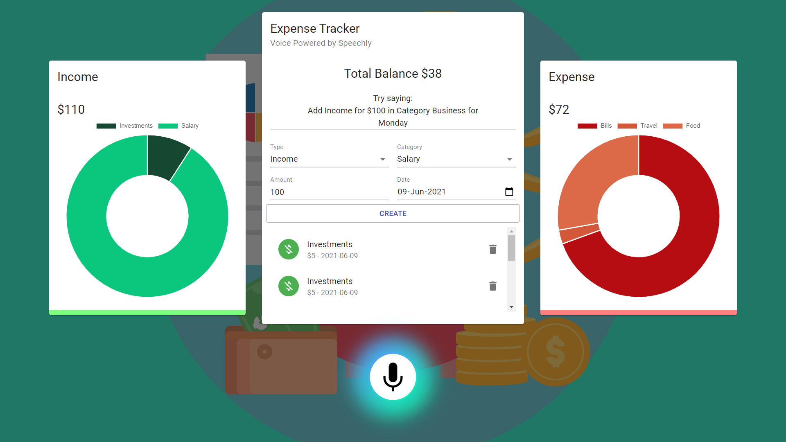

# Expense Tracker - <a href="https://track-your-expense-with-speechly.netlify.app/" target="_blank">Live Demo</a>

<table>
<tr>
<td>
  <b>An elegant, voice-controlled expense tracker powered by React, Material UI and Speechly</b>
</td>
</tr>
</table>

## Tech used:
- React
- Material UI
- React Context
- Custom Hooks
- Speechly [<a href="https://www.speechly.com/" target="_blank">More info</a>]

## Setup:

- run <code>npm i && npm start</code>

## Demo 

